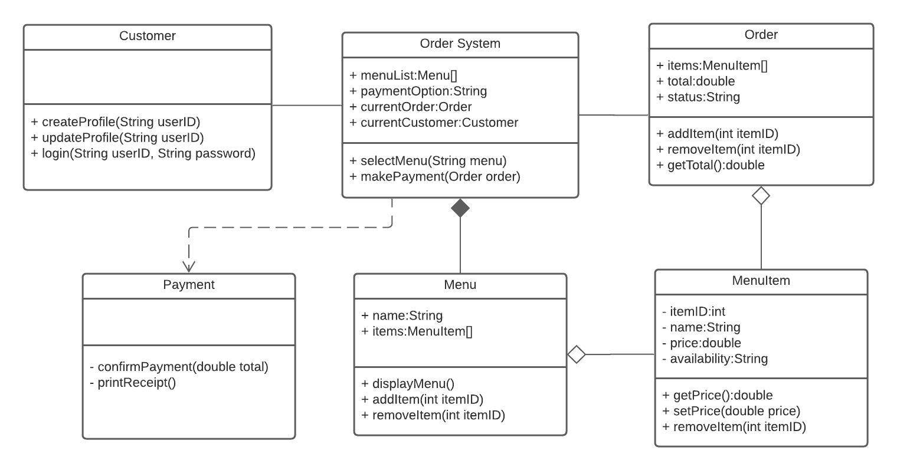

## Learning Outcomes
* You will be able to create interfaces and abstract classes to describe code
* You will be able to describe code shown in UML diagrams
* You will be able to write code that is organized, easily understood, and free of errors

## Topics Covered:

- UML diagrams
- Interfaces
- Abstract classes methods

# Instructions

You will be building the interfaces and abstract classes for the assignment. You will not need to code the business logic.

The class diagram shows a design for an online ordering system. Based on the diagram, create interfaces and abstract classes according to the project requirements below. Make sure to include all the listed properties and method signatures.

# Project Requirements
Create interfaces or abstract classes for all of the displayed classes in the diagram. Use OrderSystem.java for your work.

Interfaces:
* Customer
* Payment

Abstract Classes:
* OrderSystem
* Order
* Menu
* MenuItem

## Testing

All interfaces, classes, methods and properties displayed in the UML class diagram submitted should be implemented in the Java code. Compile and run the tests defined in `OrderSystemTest.java` to confirm that you have defined the interface and abstract classes correctly.

### Additional Testing
You can generate a UML class diagram from your code and compare against the original diagram to see if you've missed anything. In order to generate a UML diagram, install the UML Generator plugin in IntelliJ.

## Reflection
*Each activity, we'll try to give you something a little extra to think about. Write a short response to this question:*

What determines whether interfaces or abstract classes can be used to define an object?

## Submission
Submit the URL and your response to the reflection question to your Github repository.

### Grading
This activity will be graded according to the following completion criteria and learning outcomes:

#### Completion Criteria
* Interfaces or abstract classes are defined for all classes in UML Class diagram.
* Interfaces and abstract classes include all properties and methods included in UML Class diagram.
* Interfaces or abstract classes and method signatures compile without error.
* Testing code is present and unmodified
* There are no failing tests
